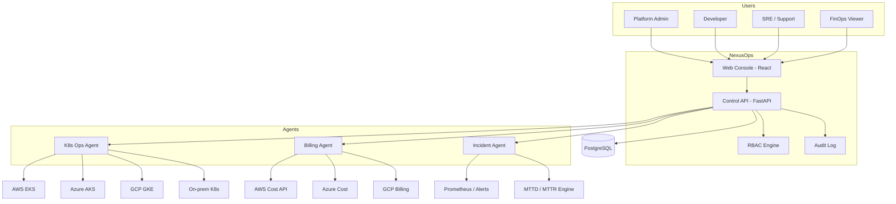

# NexusOps Architecture

## Overview

NexusOps is a **control plane + web console** for multi-cloud Kubernetes. It follows the same principle as enterprise application server consoles: a single browser UI that drives configuration and operations across a distributed environment — here, Kubernetes clusters instead of application servers.

## High-Level Diagram

## Components

### 1. Web Console (frontend)

- Tree navigation: Clusters → Namespaces → Workloads
- Role-based views (developers see deploy; FinOps sees billing only)
- Incident timeline and MTTD/MTTR dashboards
- Billing charts and budget alerts

### 2. Control API (backend)

- Authentication (JWT)
- RBAC enforcement on every route
- Cluster registry CRUD
- Proxy to agents for sync and actions
- Audit log for all mutating operations

### 3. Agents

| Agent | Responsibility |
|-------|----------------|
| **K8s Ops** | Connect clusters, sync resources, execute scale/restart/log actions |
| **Billing** | Pull cloud cost APIs, map to cluster/namespace/team, budget alerts |
| **Incident** | Ingest alerts, create incidents, compute MTTD/MTTR on resolve |

Agents run as Python modules invoked by the API (later: separate worker processes or CronJobs).

### 4. Data Store

PostgreSQL tables: users, roles, clusters, audit_events, incidents, cost_snapshots.

## Multi-Cluster Model

- **Host control plane:** NexusOps API + DB (single deployment)
- **Member clusters:** Registered via kubeconfig or cloud IAM; no NexusOps install required on each cluster for MVP
- **Connection modes:** Direct API (public endpoint) or agent tunnel (private clusters — future)

## Security

- Least-privilege RBAC per role
- No shared cluster admin credentials in the UI — per-user tokens or service accounts
- Audit trail for compliance (GDPR-aware logging: who, what, when, which cluster)

## MVP Phases

| Phase | Scope |
|-------|-------|
| 1 | API + RBAC + 1 cluster dashboard |
| 2 | Incident agent + MTTD/MTTR |
| 3 | Billing agent (AWS first) |
| 4 | Multi-cluster + React console |
| 5 | Thesis evaluation + demo video |
