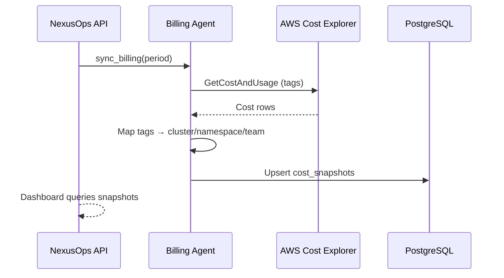

# Billing Agent (FinOps)

The billing agent aggregates **cloud spend** and maps it to **Kubernetes context** (cluster, namespace, labels/tags, team).

## Goals

- Single cost view across AWS, Azure, GCP
- Chargeback by team/project/environment
- Budget thresholds and alerts
- Support FinOps viewers without ops write access

## Data Flow

## Cloud Integrations (phased)

| Cloud | API | MVP |
|-------|-----|-----|
| AWS | Cost Explorer (`boto3`) | Phase 3 |
| Azure | Cost Management API | Phase 4 |
| GCP | Cloud Billing API | Phase 4 |

## Tagging Convention

Recommended labels for chargeback:

- `nexusops.io/team`
- `nexusops.io/project`
- `nexusops.io/environment`

## API Endpoints

- `GET /api/v1/billing/summary` — total by period
- `GET /api/v1/billing/by-cluster` — breakdown per cluster
- `GET /api/v1/billing/by-team` — chargeback report
- `POST /api/v1/billing/sync` — trigger agent sync (platform_admin)

## Agent Module

See `agents/billing/collector.py` — stub with `sync_billing()` interface.
