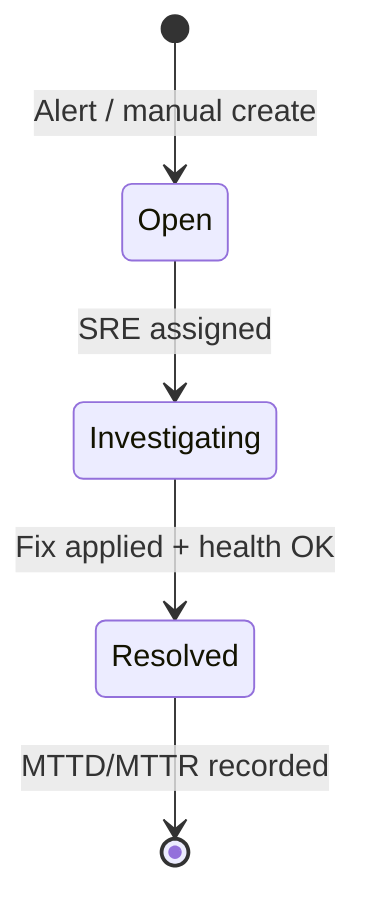

# Incident Agent — MTTD & MTTR

## Definitions

| Metric | Meaning | NexusOps measurement |
|--------|---------|----------------------|
| **MTTD** (Mean Time To Detect) | How long until a problem is detected | `detected_at - failure_started_at` |
| **MTTR** (Mean Time To Repair) | How long until service is restored | `resolved_at - detected_at` |

## Incident Lifecycle

## Timestamps

| Field | Set when |
|-------|----------|
| `failure_started_at` | From alert payload or first unhealthy signal |
| `detected_at` | Incident record created (alert ingested) |
| `resolved_at` | User or automation marks resolved |
| `assigned_at` | SRE takes ownership |

**MTTD** = `detected_at - failure_started_at`  
**MTTR** = `resolved_at - detected_at`

## Alert Sources (phased)

1. Manual incident creation (MVP)
2. Webhook from Prometheus Alertmanager
3. Kubernetes event watcher (CrashLoopBackOff, etc.)

## API Endpoints

- `GET /api/v1/incidents` — list with filters
- `POST /api/v1/incidents` — create (sre, cluster_admin)
- `PATCH /api/v1/incidents/{id}` — update status, assign
- `GET /api/v1/incidents/metrics` — MTTD/MTTR aggregates

## Dashboard Metrics

- Average MTTD / MTTR by cluster (7d, 30d)
- Incident count by severity
- Top services by MTTR

## Thesis Evaluation Idea

Run lab scenario: deploy failing app → measure MTTD with/without automated alerting → document improvement methodology (honest lab numbers, not production claims).

## Agent Module

See `agents/incident/metrics.py` — `compute_mttd()`, `compute_mttr()`, `aggregate_metrics()`.
